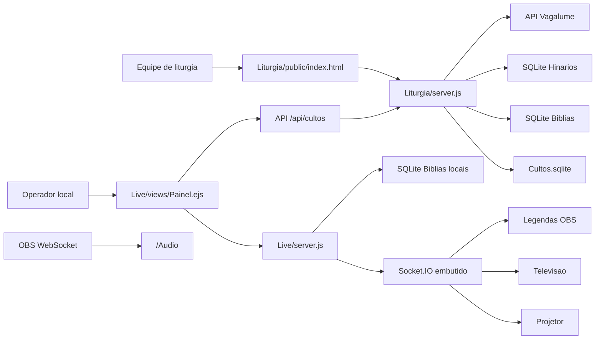

# Sistema - IPE Live

Data da análise: 2026-05-02

## Escopo Da Fonte

Esta documentação foi feita a partir de leitura estática do repositório e de schema SQLite local. Não foram executados `npm start`, PM2, deploy, SSH, FTP, migrations, comandos destrutivos ou acesso a banco externo/produção.

Referências principais analisadas:

- `AGENTS.md`
- `.ai/AI_BOOTSTRAP.md`
- `.ai/INSTRUCTIONS.md`
- `.ai/SKILLS_CATALOG.md`
- `.ai/docs/IA_PORTABILIDADE.md`
- `.ai/docs/GITHUB_COPILOT_INSTRUCTIONS_MIGRATED.md`
- `.codex/skills/node-runtime/SKILL.md`
- `.codex/skills/orquestrador/SKILL.md`
- `.codex/skills/seguranca-config/SKILL.md`
- `Liturgia/package.json`
- `Liturgia/server.js`
- `Liturgia/public/index.html`
- `Liturgia/public/js/app.js`
- `Liturgia/public/js/capa.js`
- `Liturgia/ecosystem.config.js`
- `Live/package.json`
- `Live/server.js`
- `Live/views/*.ejs`
- `Live/views/includes/bibliotecas.ejs`
- `Live/public/js/*.js`
- `Live/ecosystem.config.js`
- `Live/.env.example`
- `Liturgia/database/*.sqlite` e `Live/database/*.sqlite`, apenas por schema/localização

## Propósito

Certeza: o projeto é um sistema Node.js para preparar liturgias de cultos e operar projeção/legendas ao vivo da Igreja Presbiteriana da Encruzilhada. A descrição aparece em `Liturgia/package.json`, `Live/package.json` e na documentação migrada em `.ai/docs/GITHUB_COPILOT_INSTRUCTIONS_MIGRATED.md`.

Certeza: o sistema é dividido em duas aplicações:

- `Liturgia/`: editor/cadastro de liturgias, Bíblia, hinários, louvores e coral. Roda por padrão na porta `3000`.
- `Live/`: painel local de operação, projeção, televisão, legendas para OBS, popup bíblico e monitor de áudio. Roda por padrão na porta `3001`.

Inferência: os usuários principais são equipe de liturgia, operadores de multimídia/transmissão, equipe de música/coral e liderança do culto. Essa inferência vem dos módulos de cadastro de culto, busca de passagens, hinos, louvores, coral, projeção, OBS e YouTube.

## Processos De Negócio

### Preparação Do Culto

Certeza: a equipe monta uma liturgia em `Liturgia/public/index.html`, manipulada por `Liturgia/public/js/capa.js`. A tela lista cultos, cria nova liturgia, renomeia datas, adiciona itens e salva em `Liturgia/database/Cultos.sqlite`.

Itens suportados hoje:

- `passagem`
- `hino`
- `louvor`
- `coral`

Certeza: os dados são persistidos como JSON no campo `cultos.itens`, enquanto louvores e corais são normalizados em tabelas próprias por título.

### Consulta Bíblica

Certeza: `Liturgia/server.js` fornece APIs para listar versões, livros, capítulos, contagem de versículos e buscar trechos. Os dados vêm de arquivos SQLite em `Liturgia/database/Biblias/`.

Certeza: `Live/server.js` também consulta arquivos SQLite de Bíblia em `Live/database/Biblias/` para renderizar `/Painel` e `/Biblia`.

### Hinários E Músicas

Certeza: `Liturgia/server.js` carrega hinários SQLite em `Liturgia/database/Hinarios/`, procura hinos por código/título e transforma letras em XML/OpenLyrics para o formato usado na liturgia.

Certeza: louvores e coral locais são armazenados em `Cultos.sqlite`, nas tabelas `louvores` e `coral`.

Certeza: existe proxy de busca de letras na Vagalume em `Liturgia/server.js`.

### Operação Ao Vivo

Certeza: `Live/views/Painel.ejs` é o painel do operador. `Live/public/js/Painel.js` carrega o culto do dia por `cultosUrl`, monta accordions e emite eventos Socket.IO.

Certeza: `Live/server.js` cria um Socket.IO embutido e atua como roteador de broadcast: recebe qualquer evento e reemite para todos os clientes conectados.

Certeza: telas de projeção e legenda (`Projetor`, `Televisao`, `Legendas`, `LegendasAoVivo`) usam `Live/public/js/Base.js` para processar eventos e exibir conteúdo.

### OBS, Áudio E Transmissão

Certeza: `/Audio` renderiza `Live/views/Audio.ejs`, que conecta ao OBS WebSocket v5 e exibe VU meters.

Certeza: `/Chat.php` redireciona para a URL de live do canal YouTube configurado em `Live/server.js`.

Inferência: a instalação local usa OBS Studio, browser sources e possivelmente computadores/telas de retorno no templo.

## Stack E Versões Aproximadas

### Runtime

- Node.js local observado na máquina de análise: `v22.22.1`.
- `package-lock.json` usa `lockfileVersion=3`.
- Não há Composer, PHP, Laravel, PostgreSQL, Redis ou Docker detectados.
- Há rotas de compatibilidade com nomes `.php` em `Live/server.js`, mas não há arquivos PHP de aplicação.

### Liturgia

Fonte: `Liturgia/package.json`.

- `express` `^4.22.1`
- `better-sqlite3` `^12.6.2`
- `cors` `^2.8.6`
- `nodemon` `^3.0.1` em desenvolvimento
- Scripts reais:
  - `npm run dev`: `nodemon server.js`
  - `npm start`: `node server.js`

### Live

Fonte: `Live/package.json`.

- `express` `^4.21.2`
- `socket.io` `^4.8.1`
- `ejs` `^3.1.10`
- `express-session` `^1.18.1`
- `dotenv` `^16.4.7`
- `better-sqlite3` `^11.7.2`
- `cors` `^2.8.5`
- Scripts reais:
  - `npm run dev`: `node --watch server.js`
  - `npm start`: `node server.js`

## Arquitetura Geral

### Fluxo Liturgia

1. Navegador abre `Liturgia/public/index.html`.
2. `Liturgia/public/js/capa.js` consulta `GET /Cultos`.
3. Ao abrir um culto, consulta `GET /Cultos/:arquivo`.
4. Ao salvar, envia `POST /dados/salvar-liturgia`.
5. `Liturgia/server.js` grava `cultos.itens` e atualiza `louvores`/`coral` quando aplicável.
6. APIs de Bíblia e hinário consultam SQLite readonly.

### Fluxo Live

1. Navegador abre `GET /Painel`.
2. `Live/server.js` renderiza livros/versões de Bíblia via SQLite local.
3. `Live/public/js/Painel.js` carrega o JSON do culto do dia usando `cultosUrl`.
4. Ao selecionar um item, o painel emite `socket.emit(empresa, evento, payload)`.
5. `Live/server.js` recebe por `socket.onAny` e faz `io.emit`.
6. `Live/public/js/Base.js` nas telas conectadas recebe e atualiza `<passagem>` ou `<louvor>`.

## Organização De Pastas

| Pasta | Papel |
|---|---|
| `.ai/` | Camada canônica local de IA. Define que o projeto é standalone Node e não deriva do Base.Laravel. |
| `.codex/skills/` | Skills locais: `node-runtime`, `orquestrador`, `seguranca-config`. |
| `.project/docs/` | Documentação técnica e funcional do projeto. |
| `.project/runbooks/` | Procedimentos operacionais. |
| `.project/artifacts/` | Evidências e relatórios de análise. |
| `Liturgia/` | Aplicação Node pública/de preparação. |
| `Liturgia/database/Biblias/` | Arquivos SQLite de versões bíblicas usados pela Liturgia. |
| `Liturgia/database/Hinarios/` | Arquivos SQLite de hinários usados pela Liturgia. |
| `Liturgia/public/` | UI SPA de cadastro de liturgia, CSS, JS e imagens. |
| `Live/` | Aplicação Node local/de operação e projeção. |
| `Live/database/Biblias/` | Cópias locais de Bíblias para operação offline/local. |
| `Live/database/Hinarios/` | Cópias locais de hinários. |
| `Live/views/` | Views EJS do painel, projeção, legendas, Bíblia e áudio. |
| `Live/public/Bibliotecas/` | Bibliotecas frontend locais usadas pelo Live. |
| `Live/public/js/` | JS do painel, base de projeção, popup bíblico e telas. |

## Pontos De Entrada

### Entradas Node

- `Liturgia/server.js`: Express, APIs de Bíblia, culto, dados, hinário, formulários e proxy Vagalume.
- `Live/server.js`: Express, EJS, Socket.IO, session, API de cultos, rotas de telas, popup bíblico, relógio, YouTube e áudio.

### Entradas De UI

- `Liturgia/public/index.html`
- `Live/views/Painel.ejs`
- `Live/views/Biblia.ejs`
- `Live/views/Projetor.ejs`
- `Live/views/Televisao.ejs`
- `Live/views/Legendas.ejs`
- `Live/views/LegendasAoVivo.ejs`
- `Live/views/Audio.ejs`

### PM2

- `Liturgia/ecosystem.config.js`: app `IPE-Liturgia`, `script: server.js`, `watch: true`, `max_memory_restart: 200M`.
- `Live/ecosystem.config.js`: app `IPE-Live`, `script: server.js`, `watch: true`, `max_memory_restart: 300M`, `NODE_ENV=production`.

## Rotas Principais

### Liturgia

| Método | Rota | Propósito |
|---|---|---|
| `GET` | `/biblia/versoes` | Lista arquivos de versões bíblicas. |
| `GET` | `/biblia/livros` | Lista livros de uma versão. |
| `GET` | `/biblia/capitulos` | Total de capítulos por livro. |
| `GET` | `/biblia/versiculos-count` | Total de versículos por capítulo. |
| `GET` | `/biblia/versiculos` | Busca trecho bíblico. |
| `GET` | `/Cultos` | Lista cultos por data. |
| `GET` | `/Cultos/:arquivo` | Retorna culto expandido em JSON. |
| `POST` | `/dados/nova-liturgia` | Cria liturgia vazia. |
| `POST` | `/dados/salvar-liturgia` | Persiste lista de itens e normaliza louvores/coral. |
| `POST` | `/dados/renomear-liturgia` | Altera `data_culto`. |
| `GET` | `/hinario/lista` | Lista hinários disponíveis. |
| `GET` | `/hinario/buscar` | Busca hinos por número/título. |
| `GET` | `/hinario/hino` | Retorna hino completo. |
| `POST` | `/formularios/*` | Retorna fragmentos HTML para a UI. |
| `GET` | `/api/vagalume/buscar` | Proxy de busca de música. |
| `GET` | `/api/vagalume/letra` | Proxy de letra por `musid`. |

### Live

| Método | Rota | Propósito |
|---|---|---|
| `GET` | `/api/cultos/:arquivo` | Lê culto de `CULTOS_DIR` ou redireciona para `CULTOS_URL`. |
| `GET` | `/` | Redireciona para `/Painel`. |
| `GET` | `/Painel` | Painel do operador. |
| `GET` | `/Biblia` | Popup de navegação bíblica. |
| `GET` | `/Projetor` | Tela de projeção principal. |
| `GET` | `/Televisao` | Tela de TV com relógio. |
| `GET` | `/Legendas` | Legenda para OBS com delay. |
| `GET` | `/LegendasAoVivo` | Legenda sem delay. |
| `GET` | `/Audio` | Monitor de áudio OBS WebSocket. |
| `GET` | `/Hora` e `/Hora.php` | Hora do servidor em JSON. |
| `GET` | `/Chat.php` | Redireciona para live do YouTube. |

## Eventos Socket.IO

Padrão: `socket.emit(empresa, nomeEvento, dados)`.

| Evento | Origem | Destino | Propósito |
|---|---|---|---|
| `hino` | Painel | Telas | Exibir hino. |
| `louvor` | Painel | Telas | Exibir louvor ou coral tratado como louvor visual. |
| `passagem` | Painel ou popup Bíblia | Telas | Exibir texto bíblico. |
| `Alerta` | Painel | Telas com alerta | Exibir mensagem temporária. |
| `fecharJanela` | Painel | Telas | Ocultar conteúdo visível. |
| `fecharBiblia` | Painel | Telas | Ocultar passagem bíblica. |
| `obsSceneChanged` | OBS/Legendas | Painel e telas | Atualizar cena atual e filtrar seção no painel OBS. |

## Documentação Existente

Estado observado:

- Atual e canônica para IA: `.ai/AI_BOOTSTRAP.md`, `.ai/INSTRUCTIONS.md`, `.ai/SKILLS_CATALOG.md`.
- Útil, mas histórica/migrada: `.ai/docs/GITHUB_COPILOT_INSTRUCTIONS_MIGRATED.md` e `.ai/docs/GEMINI_MIGRATED.md`.
- Inicial e incompleta antes desta análise: `.project/runbooks/OPERACAO.md`.
- Ausente antes desta análise: documentação completa em `.project/docs/`.

Classificação: a documentação estava parcialmente atual na camada IA, mas dispersa e insuficiente para operação, arquitetura, módulos e banco. Esta rodada consolida a documentação funcional e técnica em `.project/`.

## Regras Importantes Do Projeto

- Não tratar como derivado do Base.Laravel.
- Não usar `template/main`, `template-sync`, Core Protegido ou regras multi-tenant.
- Alterações em tipos de conteúdo devem avaliar `Liturgia` e `Live` juntos.
- Não substituir tags HTML customizadas (`<passagem>`, `<louvor>`, `<titulo>`, `<corpo>`, `<rodape>`, `<texto>`) sem necessidade real.
- Não executar PM2, deploy, SSH, FTP, migrations, banco real ou produção sem aprovação explícita.
- Não copiar segredos para documentação.

## Riscos De Alto Nível

- Segredos hardcoded versionados: segredo de sessão em `Live/server.js` e chave da Vagalume em `Liturgia/server.js`.
- `Cultos.sqlite` é arquivo local ignorado pelo Git e pode conter dado operacional real; backups e restauração precisam ser formalizados.
- O repositório rastreia caminhos `live/` em minúsculo, enquanto a árvore local aparece como `Live/`. Com `core.ignorecase=true`, isso funciona no macOS, mas pode gerar problemas em ambiente case-sensitive.
- O Socket.IO reemite qualquer evento recebido sem autenticação/autorização visível.
- O painel e rotas de cadastro não têm autenticação visível.
- `Live/views/Audio.ejs` permite senha OBS via query string `pass`; isso pode expor segredo em histórico, logs ou prints.
- A UI `Liturgia` usa CDNs externos para jQuery/Bootstrap/Font Awesome/Bootbox; indisponibilidade externa pode afetar cadastro.
- `Liturgia/database/Hinarios/HNC.sqlite` está vazio (`0 bytes`) e deve ser confirmado/removido/recuperado.

## Lacunas A Confirmar

- Ambiente real de publicação: host, diretórios, proxy, domínio, systemd/PM2 real e política de logs.
- Se `Liturgia/database/Cultos.sqlite` local é produção, cópia de produção, teste ou backup.
- Política de backup/restauração do `Cultos.sqlite`.
- Se o `Live/` deve buscar cultos por redirecionamento HTTP ou por `CULTOS_DIR` local.
- Como as bases SQLite de Bíblia/Hinário são sincronizadas entre `Liturgia` e `Live`.
- Se existe autenticação/rede restrita fora do código, por firewall, proxy ou VPN.
